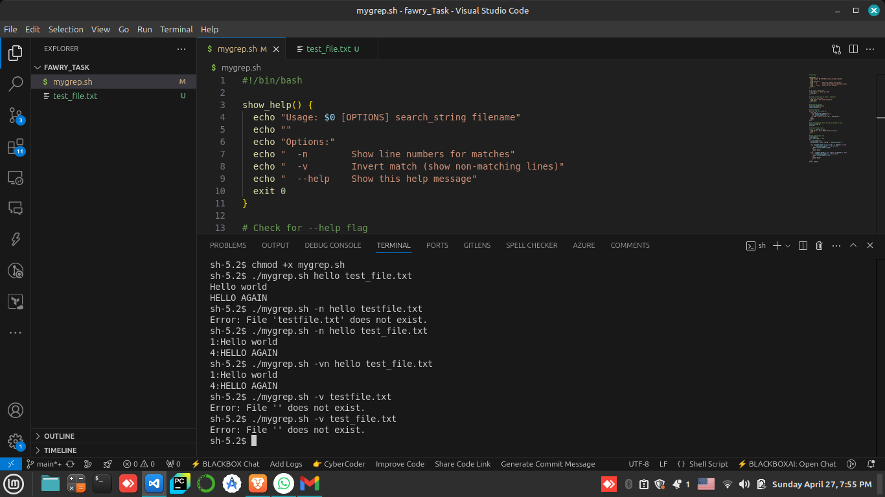
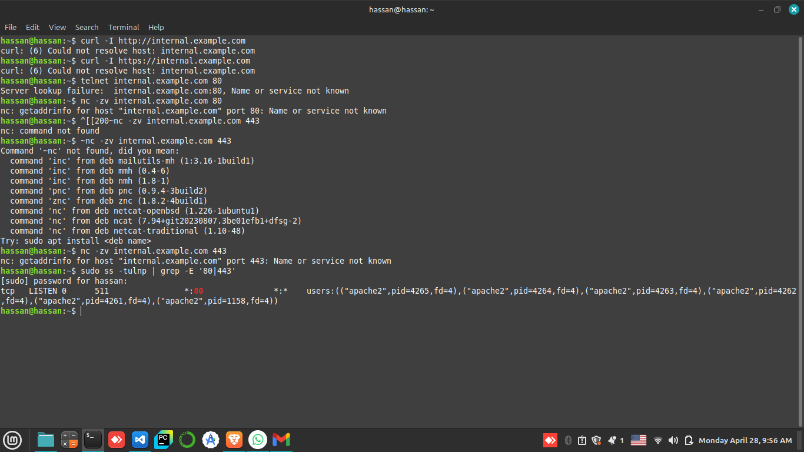
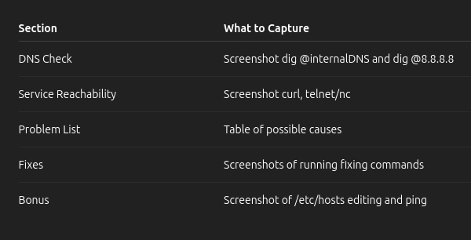

Screenshot for the Test Cases:

---

5. Reflective Section 
------------------------------------------------------>

1- How does the script handle arguments and options?

It loops through starting arguments with while [[ "$1" == -* ]] checking for flags.
It uses simple pattern matching for options (n for -n, v for -v).
Then it expects two arguments: search_string and filename.

2- If supporting regex or -i/-c/-l options, how would the structure change?

I would probably switch to getopts to parse more complex options cleanly.
Add more variables like count_only, list_filenames, etc.
Use native grep with flags internally (grep -c, grep -l, etc.) or extend manual matching.

3- The Hardest part?

Handling combinations like -vn, -nv cleanly was tricky, because Bash option parsing is messy without getopts.
Also making sure that missing arguments are caught properly, not silently failing.

---

6. Bonus:
------------------------------------------------------>

--help is working ......

If we try:  ./mygrep.sh --help

---

Q2 SOLUTION PLAN
------------------------------------------------------>

1. Verify DNS Resolution:

First, check what your default DNS says:
cat /etc/resolv.conf

we can see nameserver IP(s) listed there.
Use that IP to resolve the domain:
dig @<your_dns_server> internal.example.com
As  shown in /etc/resolv.conf IP is 172.0.0.53:
dig @127.0.0.53 internal.example.com

Comparing using Google DNS (8.8.8.8):
dig @8.8.8.8 internal.example.com

---

> Interpret Results:

If the internal DNS fails but 8.8.8.8 works... → DNS server issue.

If both DNSs fail... → Maybe host doesn't exist or DNS misconfigured.

If IPs are different... → There is a potential wrong internal DNS record.

---

2. Diagnose Service Reachability

Once we have an IP address, we check if the service responds.

Test HTTP/HTTPS ports:

Using curl:

curl -I http://internal.example.com
curl -I https://internal.example.com

we Check port manually using telnet or nc:

telnet internal.example.com 80

or

nc -zv internal.example.com 80
nc -zv internal.example.com 443

Local service check (server side only):

If we have SSH access to the internal server:

sudo ss -tulnp | grep -E '80|443'

or

sudo netstat -tulnp | grep -E '80|443'

(Shows if Nginx, Apache, etc., are listening.)

---

3. Trace the Issue – List All Possible Causes

Here’s a list we can include:

---

4. Propose and Apply Fixes

For each cause, we’ll see what to check and how to fix it:

---

1. DNS Record Incorrect

Check:

dig internal.example.com

If the IP is wrong, update the internal DNS server (or ask your admin).

Fix (example on Linux DNS server):

sudo nano /etc/bind/db.internal.example.com
sudo systemctl reload bind9

---

2. DNS Cache Corrupted

Check:

Sometimes resolvectl can tell you DNS cache status.

Fix:

sudo systemd-resolve --flush-caches

---

3. Firewall Blocking

Check:

sudo ufw status

or

sudo iptables -L

Fix:

sudo ufw allow 80/tcp
sudo ufw allow 443/tcp

---

4. Service Not Listening

Check:

sudo ss -tulnp | grep -E '80|443'

If nothing shows, service is down.

Fix:

sudo systemctl restart nginx

or

sudo systemctl restart apache2

---

5. Bad /etc/hosts Entry

Check:

cat /etc/hosts

Fix: Edit and correct it:

sudo nano /etc/hosts

Example to add manually:

192.168.1.100 internal.example.com

---

Bonus Tasks
--------------------------------------->

a. Bypass DNS using /etc/hosts

Manually add:

sudo nano /etc/hosts

Add:

192.168.1.100 internal.example.com

Then test:

ping internal.example.com

b. Persist DNS settings (systemd-resolved or NetworkManager)

If using systemd-resolved:

sudo nano /etc/systemd/resolved.conf

Uncomment and set:

DNS=8.8.8.8
FallbackDNS=1.1.1.1

Restart it:

sudo systemctl restart systemd-resolved

If using NetworkManager:

nm-connection-editor

Edit your network connection.

Set DNS servers manually.

Save and restart networking:

sudo systemctl restart NetworkManager

---

Final Deliverables for the Report:

